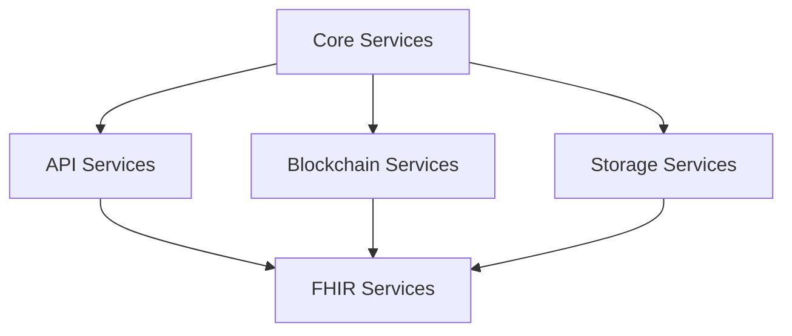

# Services Architecture

This directory contains all service modules organized by functional domain for better maintainability and development experience.

## 📁 Directory Structure

```
services/
├── index.ts                    # Main exports with backward compatibility
├── core/                       # Base clients and shared utilities
│   ├── index.ts
│   └── apiClient.ts           # HTTP client configuration
├── api/                        # External API communication
│   ├── index.ts
│   ├── studyApiService.ts     # Study management API calls
│   └── dataVaultService.ts    # Medical data upload/storage
├── blockchain/                 # Web3 and smart contract interactions
│   ├── index.ts
│   └── studyCriteriaService.ts # Study criteria blockchain queries
├── fhir/                      # Medical data processing
│   ├── index.ts
│   ├── fhirToZkMappings.ts    # FHIR → ZK value mappings
│   └── fhirIntegrationService.ts # Complete FHIR workflow
└── storage/                   # Data storage and encryption
    ├── index.ts
    ├── aesKeyStore.ts         # AES key management
    └── ipfsService.ts         # IPFS file storage
```

## 🎯 Service Categories

### Core Services (`/core`)

**Purpose**: Base clients and shared utilities

- **apiClient.ts**: Configured Axios client for API communication
- Base HTTP client with authentication and error handling
- Shared by all API-dependent services

### API Services (`/api`)

**Purpose**: External API communication and endpoints

- **studyApiService.ts**: Study creation, management, templates
- **dataVaultService.ts**: Medical data upload, storage, retrieval
- RESTful API interactions with backend services

### Blockchain Services (`/blockchain`)

**Purpose**: Web3, smart contracts, and ZK proof interactions

- **studyCriteriaService.ts**: Study criteria blockchain queries, ZK proof generation
- Smart contract interactions using ethers.js
- Zero-knowledge proof utilities

### FHIR Services (`/fhir`)

**Purpose**: Medical data processing and FHIR standard compliance

- **fhirToZkMappings.ts**: Medical code mappings (LOINC, SNOMED CT, ICD-10)
- **fhirIntegrationService.ts**: Complete FHIR processing workflow
- Standards-compliant medical data transformation

### Storage Services (`/storage`)

**Purpose**: Data storage, encryption, and file management

- **aesKeyStore.ts**: AES encryption key management
- **ipfsService.ts**: Decentralized file storage via IPFS
- Local storage and encryption utilities

## 📦 Import Patterns

### Recommended Imports (New Structure)

```typescript
// Import from specific service categories
import { apiClient } from "@/services/core";
import { createStudy, useCreateStudy } from "@/services/api";
import { getStudyFormFields, useStudyFields } from "@/services/blockchain";
import { processFHIRForStudy, fhirGenderToZK } from "@/services/fhir";
import { addAESKeyToStore, getAESKey } from "@/services/storage";

// Import entire categories
import * as ApiServices from "@/services/api";
import * as FhirServices from "@/services/fhir";
```

### Legacy Imports (Backward Compatible)

```typescript
// Old import paths still work during transition
import { apiClient } from "@/services/apiClient";
import { createStudy } from "@/services/studyApiService";
import { getStudyFormFields } from "@/services/studyCriteriaService";
```

### Category-Based Imports

```typescript
// Import from main services index
import {
  apiClient, // Core
  createStudy, // API
  getStudyFormFields, // Blockchain
  processFHIRForStudy, // FHIR
  addAESKeyToStore, // Storage
} from "@/services";
```

## 🔧 Service Dependencies



- **Core Services**: No dependencies (base layer)
- **API Services**: Depend on Core (apiClient)
- **Blockchain Services**: Independent Web3 operations
- **FHIR Services**: Can use API, Blockchain, Storage services
- **Storage Services**: Independent storage operations

## ⚡ Usage Examples

### Study Creation Workflow

```typescript
import { createStudy } from "@/services/api";
import { getStudyFormFields } from "@/services/blockchain";

// Get form data from blockchain
const formFields = await getStudyFormFields(studyAddress);

// Create study via API
const result = await createStudy({
  title: "Medical Research Study",
  criteria: formFields.criteria,
  templateName: "DIABETES_STUDY",
});
```

### FHIR Data Processing

```typescript
import { processFHIRForStudy, validateFHIRData, extractZKValuesFromFHIR } from "@/services/fhir";

// Complete FHIR workflow
const result = processFHIRForStudy(fhirBundle, studyCriteria);

if (result.eligibility?.isEligible) {
  // Use ZK-ready values for proof generation
  const zkValues = result.eligibility.zkReadyValues;
}
```

### Storage Operations

```typescript
import { addAESKeyToStore, getAESKey } from "@/services/storage";
import { uploadMedicalData } from "@/services/api";

// Store encryption key
addAESKeyToStore(encryptionKey);

// Upload encrypted data
const uploadResult = await uploadMedicalData(file, studyId);
```

## 🔄 Migration Guide

### Updating Existing Code

1. **Find current imports**:

   ```bash
   grep -r "from.*services/" apps/web/
   ```

2. **Update import paths**:

   ```typescript
   // Old
   import { apiClient } from "@/services/apiClient";

   // New (specific)
   import { apiClient } from "@/services/core";

   // New (main index)
   import { apiClient } from "@/services";
   ```

3. **Test imports**:
   All old import paths continue to work due to re-exports in the main index.

### Benefits of New Structure

- **🎯 Clear Separation**: Each service category has distinct responsibilities
- **🔍 Easy Discovery**: Find services by functional domain
- **📦 Better Imports**: Import exactly what you need
- **🧪 Easier Testing**: Test service categories independently
- **📚 Self-Documenting**: Structure explains service relationships
- **🔄 Backward Compatible**: Existing code continues to work

## 🧪 Testing Structure

```
__tests__/
├── core/
│   └── apiClient.test.ts
├── api/
│   ├── studyApiService.test.ts
│   └── dataVaultService.test.ts
├── blockchain/
│   └── studyCriteriaService.test.ts
├── fhir/
│   ├── fhirToZkMappings.test.ts
│   └── fhirIntegrationService.test.ts
└── storage/
    ├── aesKeyStore.test.ts
    └── ipfsService.test.ts
```

Each service category can be tested independently with mocked dependencies from other categories.

## 🎉 Next Steps

1. **Update existing imports** gradually across the codebase
2. **Add service-specific documentation** in each category
3. **Implement category-based testing** structure
4. **Create service-specific types** and interfaces
5. **Add service health checks** and monitoring
