Perfect! Let me redesign the ideal flow without staking - using reputation, rate limiting, and cryptographic commitments instead.

## 🏛️ **IDEAL SECURITY FLOW (No Staking)**

### **Phase 1: Public Discovery**

```mermaid
sequenceDiagram
    participant User as 👤 Patient
    participant Frontend as 🖥️ Frontend
    participant Backend as 🏢 Backend
    participant Blockchain as ⛓️ Blockchain

    User->>Frontend: Browse studies
    Frontend->>Backend: GET /studies
    Backend-->>Frontend: Public info only (titles, rewards, general requirements)
    Note over Backend: NO exact eligibility criteria
```


### **Phase 2: Authenticated Interest (Wallet + Signature)**
```typescript
// User must prove wallet ownership to see more details
const authenticatedFlow = {
  step1: "User connects wallet",
  step2: "Signs message: 'Request details for Study X at timestamp Y'",
  step3: "Backend validates signature + checks wallet reputation",
  step4: "If valid wallet: reveal detailed (but still fuzzy) requirements",
  step5: "Rate limit: 1 detail request per study per wallet per day"
}
```

### **Phase 3: Commitment Without Staking (Cryptographic Binding)**
```typescript
// Cryptographic commitment prevents criteria shopping
const commitmentFlow = {
  step1: "User commits to apply: signs 'I will apply to Study X with my real data'",
  step2: "Backend generates unique nonce for this application",
  step3: "User must submit proof within 2 hours of commitment",
  step4: "Reveal EXACT criteria + circuit files",
  step5: "One-time access - can't request criteria again for same study"
}
```

### **Phase 4: Client-Side Proof Generation (Zero Trust)**
```typescript
// All sensitive operations local - same as before
const proofFlow = {
  step1: "Decrypt medical data locally",
  step2: "Generate commitment of real data + nonce", 
  step3: "Check eligibility locally",
  step4: "Generate ZK proof if eligible",
  step5: "Submit proof within time window"
}
```

### **Phase 5: Reputation-Based Verification**
```typescript
const verificationFlow = {
  step1: "Verify proof mathematically valid",
  step2: "Check wallet hasn't applied to this study before", 
  step3: "Validate commitment includes correct nonce",
  step4: "Check wallet reputation score",
  step5: "Submit to blockchain if all checks pass",
  step6: "Update wallet reputation based on application quality"
}
```

## 🔒 **KEY SECURITY MECHANISMS (No Staking):**

### **1. Progressive Disclosure System**
```typescript
interface StudyDisclosure {
  // Always public - no authentication needed
  public: {
    id: number;
    title: string;
    description: string;
    compensation: string;
    estimatedDuration: string;
    researchOrganization: string;
  };
  
  // Requires wallet signature - rate limited
  authenticated: {
    generalRequirements: string[];  // "Adults 18-65", "Normal BMI range"
    dataTypes: string[];           // "Age, BMI, Blood pressure readings"
    exclusionCriteria: string[];   // "No current medications", "No heart conditions"
    estimatedEligibility: string;  // "~15% of population eligible"
  };
  
  // Requires commitment - one-time access per wallet
  committed: {
    exactCriteria: StudyCriteria;  // Precise thresholds
    circuitWasm: Buffer;          // Files needed for proof generation
    provingKey: Buffer;
    applicationNonce: string;      // Prevents reuse attacks
  };
}
```

### **2. Wallet Reputation System (Instead of Staking)**
```typescript
interface WalletReputation {
  // Objective metrics
  walletAge: number;              // Days since first transaction
  transactionCount: number;       // Total transactions (anti-sybil)
  uniqueContracts: number;        // Different contracts interacted with
  
  // Platform-specific reputation
  successfulApplications: number;  // Valid applications submitted
  rejectedApplications: number;   // Invalid/fake applications  
  studiesCompleted: number;       // Studies successfully participated in
  
  // Calculated scores
  trustScore: number;             // 0-100 based on above metrics
  riskLevel: 'LOW' | 'MEDIUM' | 'HIGH';
  
  // Access controls based on reputation
  canAccessCriteria: boolean;
  maxStudiesPerMonth: number;
  requiresManualReview: boolean;
}
```

### **3. Time-Based Rate Limiting (Anti-Gaming)**
```typescript
interface RateLimits {
  // Discovery phase limits
  studyBrowsing: {
    maxStudiesPerHour: 50;        // Can browse many studies
  };
  
  // Authentication phase limits  
  criteriaRequests: {
    maxPerStudyPerDay: 1;         // Only 1 detailed view per study per day
    maxTotalPerDay: 5;            // Max 5 studies can be explored per day
    cooldownBetweenRequests: 3600; // 1 hour between different study requests
  };
  
  // Commitment phase limits
  applications: {
    maxPerWeek: 3;                // Can only apply to 3 studies per week
    timeWindowToSubmit: 7200;     // 2 hours to submit proof after commitment
    cooldownAfterRejection: 86400; // 24 hours before can apply to similar study
  };
}
```

### **4. Cryptographic Commitment System**
```typescript
class CommitmentManager {
  // Generate binding commitment without requiring tokens
  static async generateCommitment(
    walletAddress: string,
    studyId: number,
    timestamp: number
  ): Promise<ApplicationCommitment> {
    
    // Create unique nonce for this application
    const nonce = await this.generateSecureNonce(walletAddress, studyId, timestamp);
    
    // User must sign commitment message
    const commitmentMessage = `I commit to applying honestly to study ${studyId} with nonce ${nonce} at ${timestamp}`;
    const signature = await this.requestWalletSignature(commitmentMessage);
    
    // Store commitment (prevents re-requesting criteria)
    await this.storeCommitment({
      walletAddress,
      studyId,
      nonce,
      signature,
      timestamp,
      expiresAt: timestamp + 7200000 // 2 hours
    });
    
    return { nonce, signature, expiresAt: timestamp + 7200000 };
  }
  
  // Validate proof includes correct nonce (prevents criteria shopping)
  static validateProofCommitment(
    proof: ZKProofResult,
    walletAddress: string,
    studyId: number
  ): boolean {
    const storedCommitment = this.getStoredCommitment(walletAddress, studyId);
    
    // Proof must include the nonce from commitment
    return proof.publicSignals.includes(storedCommitment.nonce);
  }
}
```

### **5. Application Quality Detection**
```typescript
interface QualityDetection {
  // Detect suspicious patterns without staking
  patterns: {
    perfectMatches: boolean;        // Data exactly matches minimum criteria
    roundNumbers: boolean;          // All values are round numbers (fake)
    temporalPatterns: boolean;      // Applied to similar studies in sequence
    dataVariance: number;           // How much data varies (real data varies more)
  };
  
  // Cross-reference with known good data
  validation: {
    medicalPlausibility: boolean;   // Values make medical sense together
    demographicConsistency: boolean; // Age/BMI/etc. are consistent
    temporalConsistency: boolean;   // Vital signs taken at reasonable times
  };
  
  // Reputation adjustment based on quality
  qualityScore: number;             // Affects future application limits
  flagForReview: boolean;           // Manual review if suspicious
}
```

## 🎯 **IMPLEMENTATION ROADMAP:**

**Phase 1 (Week 1):** Progressive disclosure + wallet authentication
**Phase 2 (Week 2):** Rate limiting + commitment system  
**Phase 3 (Week 3):** Reputation scoring + quality detection
**Phase 4 (Week 4):** Cross-study coordination + advanced anti-gaming

This approach provides strong security without requiring users to stake tokens - using cryptographic commitments, reputation, and behavioral analysis instead.

Would you like me to start implementing the progressive disclosure system and wallet authentication layer?